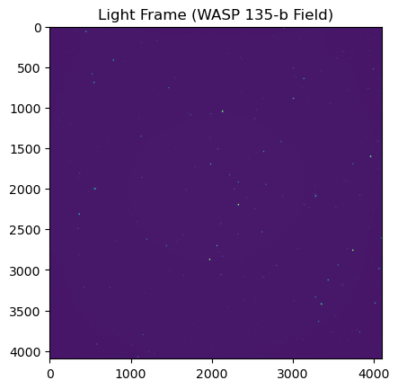

# Astro_Fits_Pipeline
Image pipeline equipped for calibration and processing of FITS images. Analysis performed using differential photometric techniques. Plate solve for WCS headers using Astrometry.net API to be supported.
- production of exoplanet transit light curves is the primary purpose of this pipeline.
- development of graphical user interface and existing features in progress.
- ideally, the final prodict will support analysis of existing tess data with libraries such as lightkurve and astropy, as well as personal observation data.
- this program should function in a manner similar to AstroImageJ, in a condensed manner.

## Data and Output
- Medians of flat and bias frames are computed and plotted as shown below:

- Light frames can be displayed in a similar manner:
  

- Comparison of uncalibrated and calibrated images (AstroImageJ window):
  

- Current adjustments remove some background, and apply reasonable lens/CCD corrections.
- Vignetting is visually reduced, as well as haze.

## Some CSV Functionality Underway
- CSV files of measurements (built by standalone pipelines) can also be analyzed via the csv_functionality script.
- This can be utilized for testing purposes as well as confirmation of pipeline accuracy.
- To ensure proper function, user must provide a file with a relative flux measurement and some type of time series (JD, MJD, etc...)

## Astrometry.net API for WCS Retrieval
- Currently calls generate an unformatted FITS header
- Header will ideally be written to the given FITS file for later use in the stacking and star location features.
