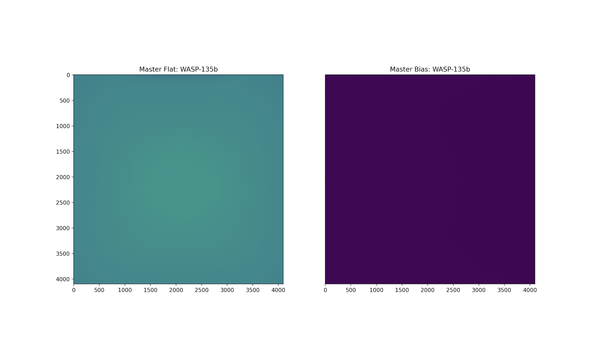
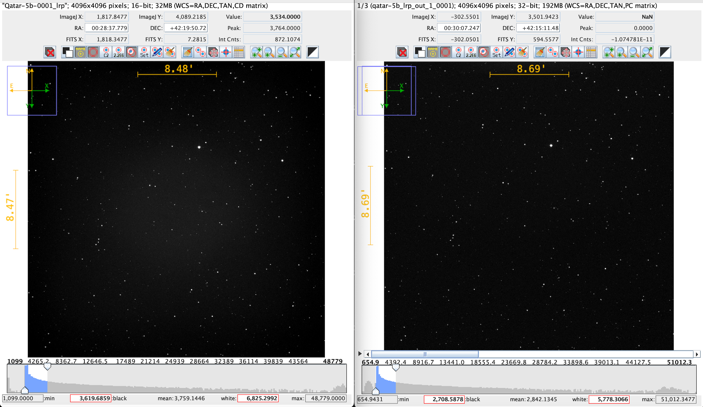
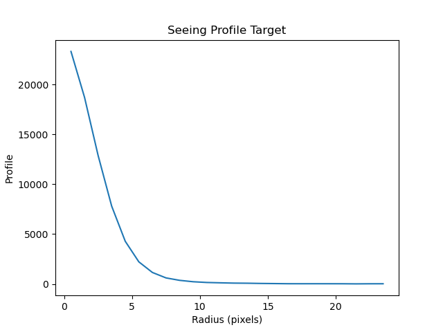
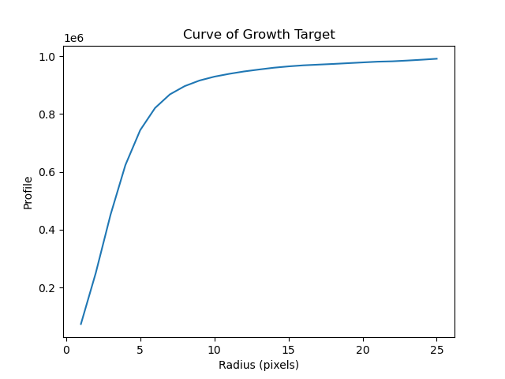
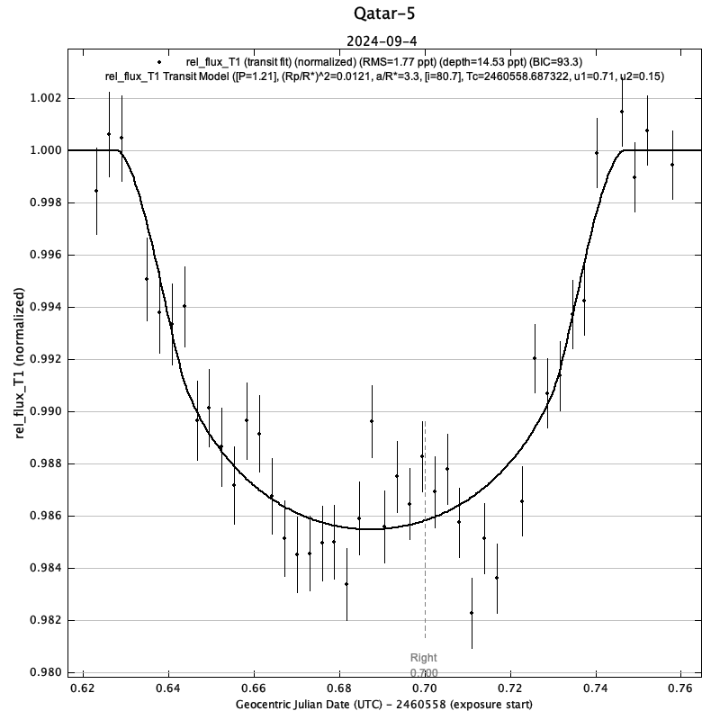
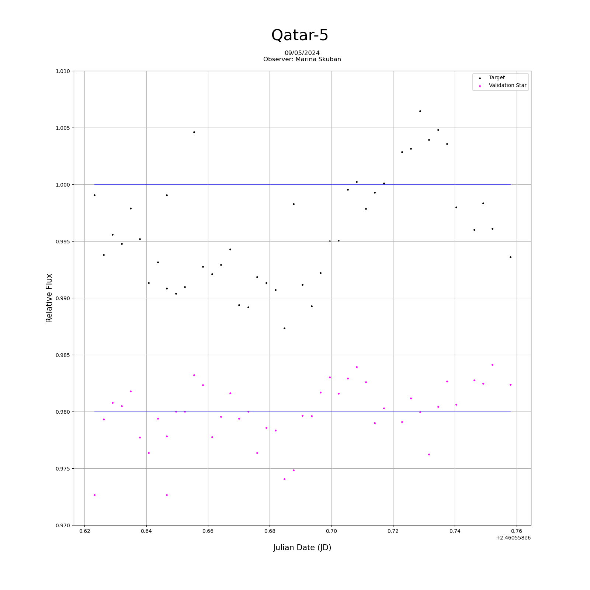

# Astro_Fits_Pipeline
#### An image pipeline for the calibration and processing of FITS images, equipped with differential photometric techniques. Dependencies include Numpy/Matplotlib, Astropy/Photutils, and Pandas (details in .env).

- Primary Goal: Production of exoplanet transit light curves.
- Development: Ongoing work on a graphical user interface (GUI) and existing features, decrease overhead computation.
- Target Data: The pipeline aims to support analysis of existing TESS data with libraries such as Astropy, the Photutils sub-package, and personal/group observational data.
- Functionality: Designed to work similarly to AstroImageJ, but in a more condensed and streamlined manner.

### Data and Output
Median of flat and bias frames are computed and mapped to a color plot as shown below:

  

- Comparison of uncalibrated and calibrated images (AstroImageJ window):

  

- Current Adjustments: These remove some background noise, apply lens/CCD corrections, reduce vignetting, and mitigate haze.

   

- Pipeline Output: The pipeline generates both seeing profiles and cumulative flux plots for the target and comparison stars (generally useful for verifying aperture radius and placement.

 
    

- Side-by-Side Comparison: AstroImageJ light curve vs STEPUP Pipeline light curve.
- Initial Results: The first full trial highlighted the need for refining relative flux calculations, considering outliers, and using WCS transformations (rather than loose catalog/pixel math) for target location. This approach, if computationally feasible, will improve accuracy.
- Future Work: A scientific method for determining aperture placements and comparison stars is also necessary.

### CSV Functionality
- CSV File Support: The pipeline includes a script for analyzing CSV files of measurements. These files can be generated by standalone pipelines.
- Testing & Validation: The script can be used for testing purposes and validating pipeline accuracy.
- Required Input: To function properly, the user must provide a CSV file containing relative flux measurements and a time series (e.g., JD, MJD).
- Output: The pipeline generates CSV files containing associated quantities (relative flux, comparison flux, and target flux, and saves them locally).
### Astrometry.net API for WCS Retrieval
- Current Functionality: The pipeline currently makes calls to the Astrometry.net API to generate an unformatted FITS header.
- Future Work: The goal is to write the WCS header to the FITS file for later use in the stacking and star location features.
